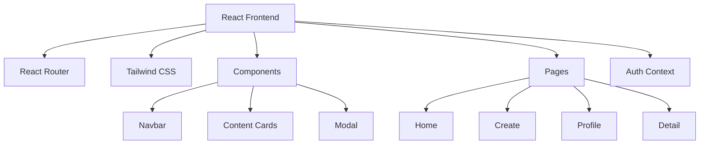

## 1. Architecture Design


## 2. Technology Description
- Frontend: React@18 + tailwindcss@3 + vite
- Initialization Tool: vite (already in use)
- Backend: Existing Express backend
- Database: Existing MongoDB/PostgreSQL setup

## 3. Route Definitions
| Route | Purpose |
|-------|---------|
| / | Home page - Explore content |
| /create | Create new content page |
| /profile/:id | User profile and space |
| /items/:id | Item detail page |
| /login | Login page |
| /register | Register page |

## 4. API Definitions
### 4.1 Auth
```typescript
// User type
interface User {
  id: string;
  username: string;
  nickname: string;
  avatar?: string;
}

// Auth API
POST /api/auth/login
POST /api/auth/register
GET /api/auth/me
```

### 4.2 Content
```typescript
// Content types
type ContentType = 'creation' | 'idea' | 'stuff';

interface Content {
  id: string;
  type: ContentType;
  title: string;
  description: string;
  image?: string;
  author: User;
  createdAt: Date;
  likes: number;
  comments: number;
}

// Content API
GET /api/content
GET /api/content/:id
POST /api/content
PUT /api/content/:id
DELETE /api/content/:id
```

## 5. Component Structure
```
src/
  components/
    Navbar.tsx
    ContentCard.tsx
    ContentGrid.tsx
    CreateModal.tsx
    ProfileHeader.tsx
  pages/
    Home.tsx
    Create.tsx
    Profile.tsx
    ItemDetail.tsx
    Login.tsx
    Register.tsx
  context/
    AuthContext.tsx
  utils/
    constants.ts
    helpers.ts
  App.tsx
  main.tsx
```

## 6. Tailwind Configuration
### 6.1 Custom Colors
```javascript
colors: {
  primary: {
    50: '#fff7ed',
    100: '#ffedd5',
    200: '#fed7aa',
    300: '#fdba74',
    400: '#fb923c',
    500: '#f97316', // Warm orange
    600: '#ea580c',
  },
  creation: {
    bg: '#dae8fc',
    text: '#3170b3',
  },
  idea: {
    bg: '#d5e8d4',
    text: '#448746',
  },
  stuff: {
    bg: '#e1d5e7',
    text: '#7f4a88',
  },
}
```

### 6.2 Custom Fonts
- Using modern sans-serif fonts with clear hierarchy
- Handwriting-style fonts for headings
