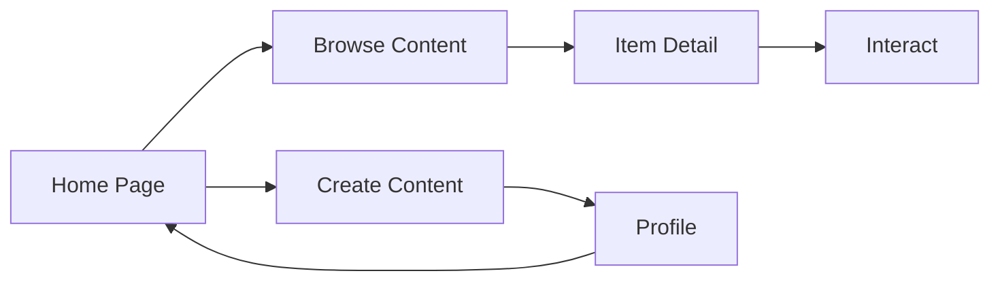

## 1. Product Overview
Wowoo 是一个创意内容分享平台，用户可以探索、发布和发现有趣的内容。
- 提供简洁、温暖、充满创意的界面设计，让用户轻松分享和探索内容
- 打造轻松愉快的用户体验，激发创意灵感

## 2. Core Features

### 2.1 User Roles
| Role | Registration Method | Core Permissions |
|------|---------------------|------------------|
| Normal User | Email/Password registration | Browse, create, and interact with content |

### 2.2 Feature Module
1. **Home page**: Hero 区域，导航栏，探索/创作/物品切换，内容卡片网格
2. **Item Detail page**: 内容详情，作者信息，互动区域，相关内容
3. **Create page**: 内容类型选择，发布表单
4. **Profile page**: 用户空间，内容管理，个人信息

### 2.3 Page Details
| Page Name | Module Name | Feature description |
|-----------|-------------|---------------------|
| Home page | Hero section | 欢迎文案，"Let's go"按钮，装饰插画 |
| Home page | Navigation | Logo，导航标签（Explore/Creations/Ideas/Stuff），搜索框，发布按钮，用户头像 |
| Home page | Content grid | 内容卡片（Creations/Ideas/Stuff），卡片悬停效果，标签样式 |
| Item Detail | Detail content | 内容标题，描述，作者信息，点赞/评论/收藏 |
| Create page | Content type | 卡片式选择（Creations/Ideas/Stuff），发布表单 |
| Profile | User space | 用户头像，统计数据，内容网格，编辑按钮 |

## 3. Core Process
用户访问首页 → 浏览和探索内容 → 点击内容查看详情 → 登录/注册后可发布自己的内容 → 在个人空间管理内容

## 4. User Interface Design

### 4.1 Design Style
- Primary color: 温暖的橙金色 (#f6b26b) 和柔和的中性色
- Secondary colors: 薄荷绿 (#d5e8d4)，淡紫色 (#e1d5e7)，浅蓝 (#dae8fc)
- Button style: 圆角按钮，柔和的阴影，悬停效果
- Font: 现代无衬线字体，标题醒目，正文简洁
- Layout style: 卡片式布局，网格展示，大量留白
- Icon style: 简约线稿图标，友好的 emoji

### 4.2 Page Design Overview
| Page Name | Module Name | UI Elements |
|-----------|-------------|-------------|
| Home page | Hero | 手写风格标题，装饰性插图，暖色调渐变背景 |
| Home page | Navigation | 简约导航栏，品牌字体，柔和的按钮样式 |
| Home page | Cards | 彩色标签，柔和阴影，图片悬停缩放效果 |
| Create page | Type selector | 彩色大卡片，图标+文字，点击动画 |
| Profile | Header | 用户信息卡片，统计数字，柔和背景 |

### 4.3 Responsiveness
- 桌面优先设计，支持移动端适配
- 在小屏幕上调整网格布局为单列
- 触摸优化的按钮尺寸
- 响应式字体大小

### 4.4 Visual Elements
- 装饰性插图和图案
- 微妙的渐变和阴影效果
- 平滑的交互动画
- 柔和的彩色标签系统
